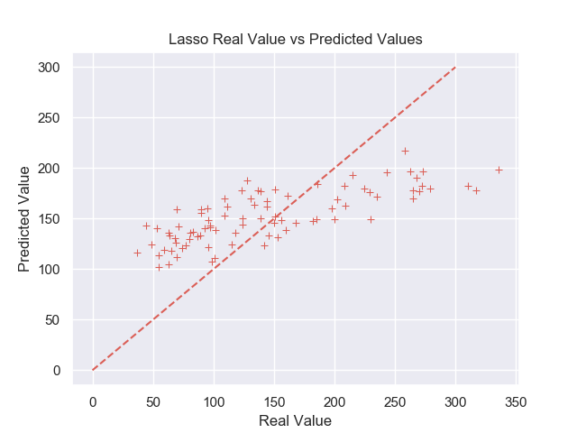

# Diabetes Regression Analysis

| Name | Date |
|:-------|:---------------|
|Marisa Alves | June 15, 2019 |

-----

## Research Question

How can individual factors and bodily variables predict the progression of diabetes in pre-diagnosed patients?

### Abstract

 During this analysis, a datset previously obtained of 442 diabetic patients who were measured on 10 baseline variables, as well as a measure of disease progression taken one year after baseline [^1] . The challenge is to form a predictive model which can be used on diabetic patients to assess (based on their feature levels) whether they are at a higher risk for their disease to progress. To try and solve this problem a variety of machine learning algorithms were formed based on our dataset. Produced was a linear regression equation based on lasso regression analysis which has the key standardized baseline features as variables for the model with corresponding coefficients. This equation is used to predict the level of diabetic disease progression, although as the model shows there is still room for improvement and not all variables seem to be drastically impacting diabetes progression. 

### Introduction

 Diabetes has long been a disease chronically associated with patients who are overweight or obese. But what other factors impact diabetic disease progression and how can the levels associated with them be used to predict diabetes progression? To attempt to answer this question we have a dataset containing the measurements of 442 diabetic patients. Measurements were made for these patients as follows: Age, sex, body mass index(bmi), blood pressure(bp), mean arterial blood pressure (map), total cholesterol (tc), low-density lipoprotein(ldl), high-density lipoprotein(hdl), tch, and glu [^2] . Unfortunately, the actualmeaning behind some of these abbreviations for variables remainds unknown. Each of these 10 features have been mean centered and scaled by the standard deviation times n_samples [^3] . A year later, these same patients were measured for disease progression, and this is the target variable, the variable we are seeking to predict. The exact variable for disease progression also remains unknown. With diabetes on the rise and hundreds of millions of people diagnosed around the world, any insight into ways to prevent or treat this disease are vitally important, and that is just what we plan to do here. 

### Methods

 To solve the diabetes problem, I first began with cleaning up the dataset as needed. As the dataset was loaded into python from sklearn already standardized, not much was needed in this department, except the following two methods. First, outliers were assessed and removed as to further improve the model. The decision to find and remove these observations that lie far outside the normal range was largely based on the boxplots for each variable (see Boxplots_features.png). For these, the outliers were colored in red, and we can see there are quite a few present. Therefore, to enhance the model 12 observations were removed from the analysis, as determined by having observations with a Z score of 3 or higher. Lastly, the sex variable was altered into two dummy variables (one of which was removed).This was performed as to not bias the data into forming a model based on the thinking that males are "superior" based on their value of 1. 

 Following the data clean up, a multiple linear regression model was conducted. While this model achieved good error, when examining the heatmap and pairplot of the variables, it is clear that not many of the variables seemed to correlate with diabetic disease progression (see diabetes_pairplot.png and diabetes_heatmap.png). Thus to improve the model, these uncorrelated variables should not be required in the regression equation. Therefore, a Lasso regression analysis was performed. Lasso is a technique to reduce model complexity and prevent over-fitting as it prefers a solution with fewer coefficients. This analysis was achieved using the Lasso Regressor which is built into scikit-learn [^4] . 

### Results

 We see from the above scatter plot there is a correlation between the blood pressure, bmi, and tch with disease progression: as they increase, so too does the diabetic disease progressor variable.

 The image above shows how the model performed when ran on the test variables. As seen, there is still significant variation between predicted and observed values for diabetic disease progression.

 In the lasso regression model, the regression equation with the best error (and that which is depicted in the graph above) is as follows: Target = 308.078485*BMI + 48.349328*BP + 270.965511*tch. This model achieved a root mean square error (RMSE) value of 57.77373, which is the standard deviation of the residuals, ie, the dispersion of the differences between the predicted values and the test values. 

### Discussion

 Overall, the final model was satisfactory. It achieved a good level of error and the regression model could decently predict the diabetic disease progression for the test set. While the dispersion of residuals are still quite varied, it is a good model to start and to base treatment for those most at risk. However, there is still room for improvement. To enhance this model I would gather more data. Prior to analysis, this dataset contains the values of 442 diabetic patients. After removal of outlier values, it contained only 430. This is considered to be a small sample size, especially when you consider the fact that there are hundreds of millions of diabetic patients around the world. Therefore, our model is limited in its validity because the more samples, the higher precision of the regression model. After more data has been collected, it may even be possible that a different test would be more powerful, and thus the methods for analysis may need to be altered. 

### References

[^1]: http://web.stanford.edu/~hastie/Papers/LARS/LeastAngle_2002.pdf
[^2]: http://garthtarr.github.io/mplot/reference/diabetes.html
[^3]: https://scikit-learn.org/stable/datasets/index.html
[^4]: https://scikit-learn.org/stable/modules/generated/sklearn.linear_model.Lasso.html
-------
